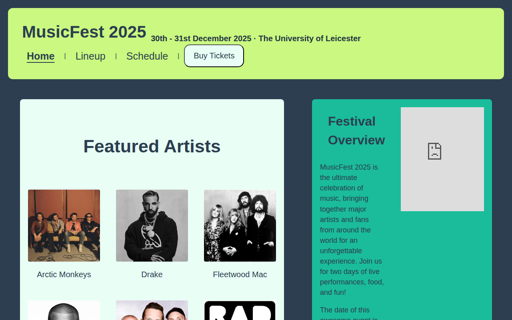
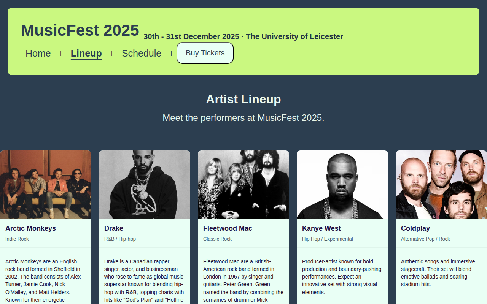
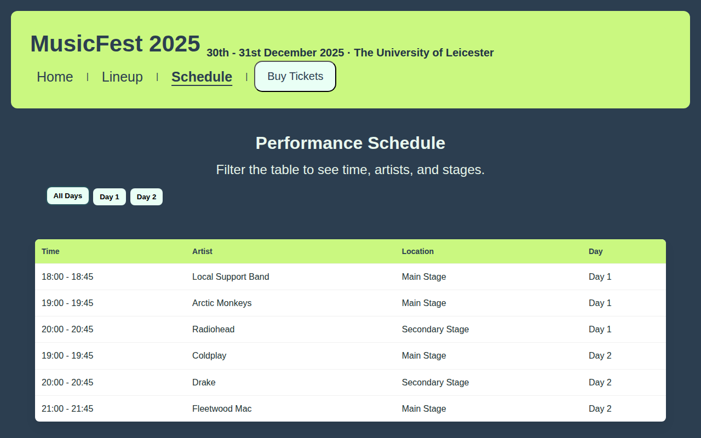
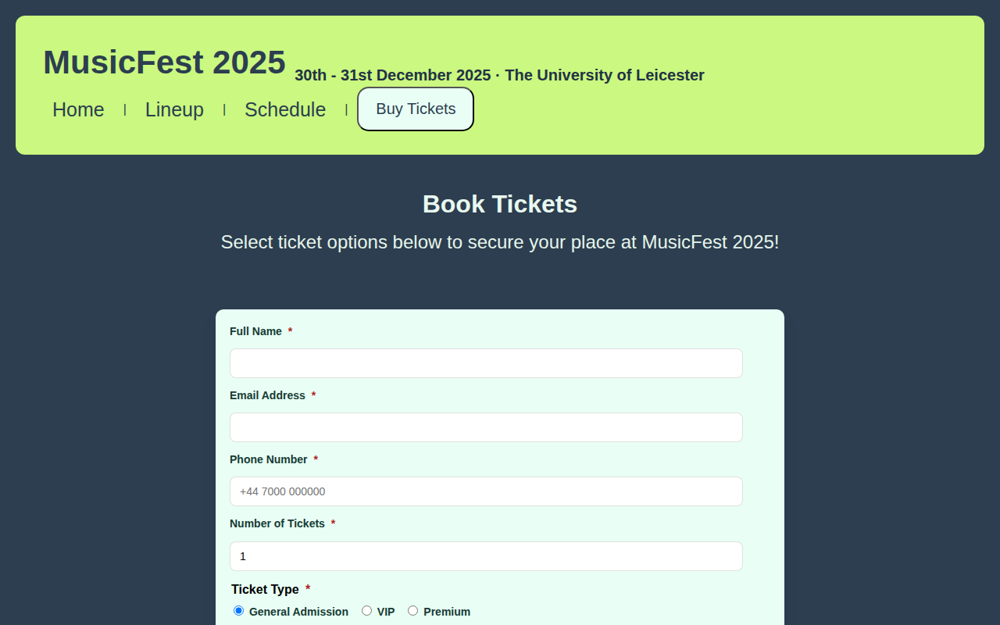

# MusicFest 2025 · University Website Project

[](https://github.com/h3nry2199/University-Website-Project/actions/workflows/pages.yml)
[](https://github.com/h3nry2199/University-Website-Project/actions/workflows/validate.yml)

A multi-page festival website built with plain HTML, CSS and JavaScript for my university web development module.

**Live site:** https://h3nry2199.github.io/University-Website-Project/



## Pages

| Page | What it shows |
| --- | --- |
| [Home](Website/index.html) | Featured artists gallery, festival overview with an embedded venue map, and the festival theme |
| [Lineup](Website/lineup.html) | Artist cards with photos and descriptions |
| [Schedule](Website/schedule.html) | Performance timetable |
| [Tickets](Website/tickets.html) | Booking form with client-side validation |

| Lineup | Schedule | Tickets |
| --- | --- | --- |
|  |  |  |

## Features

- **Responsive layout:** multi-column on desktop, stacking to a single column on phones with no sideways scrolling
- **Schedule filter:** JavaScript buttons that filter the timetable by day, with ARIA state for screen readers
- **Ticket form validation:** checks every required field and shows all errors at once in a live region
- **Accessibility:** semantic landmarks, alt text on every image, labelled form controls and the current page marked in the navigation
- **Automated checks:** every pull request is validated with [html-validate](https://html-validate.org/), and every push to `main` redeploys the live site

## Built with

- **HTML5** for page structure
- **CSS3** with Flexbox for the multi-column layout
- **JavaScript** for ticket form validation (name, email, phone, ticket quantity, payment method and terms)

## Project structure

```
Website/
├── index.html      Home page
├── lineup.html     Artist lineup
├── schedule.html   Performance schedule
├── tickets.html    Ticket booking form
├── styles.css      Shared styles for all pages
├── script.js       Form validation and schedule filter
└── images/         Artist photos
```

## Run locally

No build step is needed. Open `Website/index.html` in a browser, or serve the folder:

```bash
python3 -m http.server -d Website
```

To run the same HTML checks as CI:

```bash
npx html-validate Website/*.html
```

The site deploys to GitHub Pages automatically on every push to `main` via [`.github/workflows/pages.yml`](.github/workflows/pages.yml).

## License

The code is released under the [MIT License](LICENSE). Artist photos are used for educational purposes only and remain the property of their respective owners.
